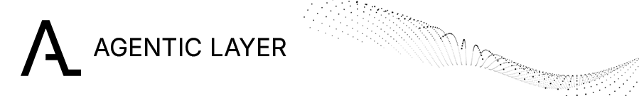

# Integrated Building Blocks for Safe, Interoperable, and Adaptive Agentic Systems

<picture style="display: block; max-width: 100%;">
  <source media="(prefers-color-scheme: dark)" srcset="al-banner-dark.png">
  <source media="(prefers-color-scheme: light)" srcset="al-banner-light.png">
  
</picture>

----

Your Bridge to Sovereign AI Orchestration.
Transform isolated AI agents into an enterprise-grade workforce.

We give you the control, security, and flexibility to unleash the full potential of Agentic AI in your enterprise. No boilerplate, no headaches.

Visit [agentic-layer.ai](https://agentic-layer.ai) to learn more!

To **get started with the Agentic Layer**, please visit [our documentation](https://docs.agentic-layer.ai/). Besides others, there you find 

- [Tutorials](https://docs.agentic-layer.ai/home/main/tutorials.html)
- [Architecture documentation](https://docs.agentic-layer.ai/architecture/main/index.html)

----

Agentic Layer projects adopt our [Code of Conduct](https://github.com/agentic-layer/.github/blob/main/CODE_OF_CONDUCT.md).

Contributions from the community are welcome! Please follow our [Contributing Guide](https://github.com/agentic-layer/.github/blob/main/CONTRIBUTING.md).
