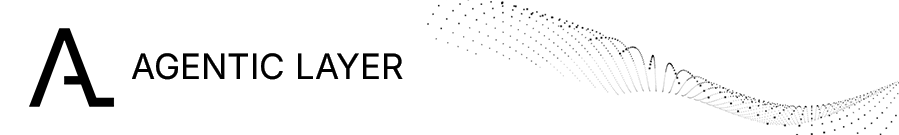

# Integrated Building Blocks for Safe, Interoperable, and Adaptive Agentic Systems

<picture style="display: block; max-width: 100%;">
  <source media="(prefers-color-scheme: dark)" srcset="al-banner-dark.png">
  <source media="(prefers-color-scheme: light)" srcset="al-banner-light.png">
  
</picture>

----

Agentic Layer is an orchestration and runtime layer for building and operating multi-agent AI systems in enterprise environments.

It provides reusable components and APIs to coordinate agents, manage execution flows, and integrate with existing systems, without locking you into a specific framework or vendor.

As a lightweight, Kubernetes-native platform add-on, it introduces clear execution boundaries, observability, and control mechanisms for running agent-based workloads in production.

To **get started with the Agentic Layer**, please visit [our documentation](https://docs.agentic-layer.ai/). Besides others, there you find 

- Tutorials
- Installation guides
- Architecture documentation

----

We are looking for contributors now! Interested? How about:

- Give the Agentic Layer a try and [discuss your experience and ideas](https://github.com/orgs/agentic-layer/discussions).
- Check out the upcoming topics in our [roadmap](https://github.com/orgs/agentic-layer/projects/4/views/4).
- Head over to our [Kanban board](https://github.com/orgs/agentic-layer/projects/4) and make your hands dirty yourself.
- Know a nice new gateway for Agents, MCP, or LLM Models? Implement your own operator based on the [agentic-layer CRDs](https://github.com/agentic-layer/agent-runtime-operator/tree/main/config/crd/bases)!
- Prefer a more efficient agent framework than ADK with Python? Implement a new [reference template](https://github.com/agentic-layer/agent-template-adk/).

----

Agentic Layer projects adopt our [Code of Conduct](https://github.com/agentic-layer/.github/blob/main/CODE_OF_CONDUCT.md).

Contributions from the community are welcome! Please follow our [Contributing Guide](https://github.com/agentic-layer/.github/blob/main/CONTRIBUTING.md).
